# Shader 之 Blend

## 什么是 Blend？

> `Blending` is used to make transparent objects.

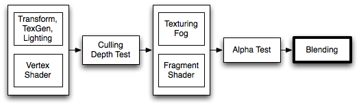

> When graphics are rendered, after all Shaders
 have executed and all Textures have been applied, the pixels
 are written to the screen. How they are combined with what is already there is controlled by the Blend command.

上面这段话是 Unity 官方对 `Blend` 命令的解释，意思大致是“ `Blend` 命令控制与已经存在在 `GBuffer` 缓存中的像素进行组合渲染（是应该渲染 `GBuffer` 中的像素？还是原游戏物体的像素？还是说两个像素做一些组合操作再渲染？）。”

## 语法

* `Blend Off`：关闭混合（这是默认值）。
* `Blend SrcFactor DstFactor`：配置并启用混合。生成的颜色乘以 `SrcFactor`。屏幕上已有的颜色乘以 `DstFactor`，两者相加。
* `Blend SrcFactor DstFactor, SrcFactorA DstFactorA`：与上面相同，但使用不同的因子来混合 `alpha` 通道。
* `BlendOp Op`：不要将混合颜色添加到一起，而是对它们执行不同的操作。
* `BlendOp OpColor, OpAlpha`：与上面相同，但对颜色`（RGB）`和 `alpha（A）`通道使用不同的混合操作。

### Blend 属性

往 `SrcFactor`/`SrcFactorA` 和 `DstFactor`/`DstFactorA` 上填的值。

* `One`：混合因子 1，表示完全的源颜色或目标颜色。
* `Zero`：混合因子 0，舍弃掉源颜色或目标颜色。
* `SrcColor`：源颜色值
* `SrcAlpha`：源透明度
* `DstColor`：目标颜色值
* `DstAlpha`：目标透明度
* `OneMinusSrcColor`：1 - `SrcColor`
* `OneMinusSrcAlpha`：1 - `SrcAlpha`
* `OneMinusDstColor`：1 - `DstColor`
* `OneMinusDstAlpha`：1 - `DstAlpha`

### [BlendOp 属性](https://docs.unity3d.com/ScriptReference/Rendering.BlendOp.html)

* `Add`：加法 
`FinalColor = SrcFactor * SrcColor + DstFactor * DstColor`
* `Sub`：减法（源-目标）
`FinalColor = SrcFactor * SrcColor - DstFactor * DstColor`
* `RevSub`：减法（目标-源）
`FinalColor = DstFactor * DstColor - SrcFactor * SrcColor`
* `Min`：较小值（逐个通道比较）
* `Max`：较大值（逐个通道比较）

下面是一些目前仅限 [`DX11.1`](https://baike.baidu.com/item/DirectX%2011) 支持的逻辑运算混合操作。

⚠️ 注意：`s == SrcFactor`，`d == DstFactor`

* `LogicalClear`：Clear (0)
* `LogicalSet`：Set (1)
* `LogicalCopy`：Copy (s)
* `LogicalCopyInverted`：Copy inverted (!s) 
* `LogicalNoop`：Noop (d)
* `LogicalInvert`：Invert (!d)
* `LogicalAnd`：And (s & d)
* `LogicalNand`：Nand !(s & d)
* `LogicalOr`：Or (s | d) 
* `LogicalNor`：Nor !(s | d) 
* `LogicalXor`：Xor (s ^ d) 
* `LogicalEquiv`：Equivalence !(s ^ d) 
* `LogicalAndReverse`：Reverse And (s & !d)
* `LogicalAndInverted`：Inverted And (!s & d) 
* `LogicalOrReverse`：Reverse Or (s | !d) 
* `LogicalOrInverted`：Inverted Or (!s | d)

## 语法分析

当使用 `Blend` 时，最终颜色被计算为 `result = fragment_color * SrcFactor + pixel_color * DstFactor`，这个 `fragment_color` 即是经过处理的片段颜色，也就是 `fragment`返回的结果，`pixel_color` 是原本存在于缓冲区`（GBuffer）`的颜色，这个 `result` 颜色被重新写入缓冲区，等待被其他片段 `Blend` 或者变成最终颜色(如果没有被其他 `Blend`)。

上面这段话是对 `语法` 中的

> `Blend SrcFactor DstFactor：配置并启用混合。生成的颜色乘以 SrcFactor。屏幕上已有的颜色乘以 DstFactor，两者相加。`

的分析，其中的 `生成的颜色` 是指 `fragment` 返回的结果，`屏幕上已有的颜色` 对应上面的 `pixel_color` 是指 `原本存在于缓冲区（GBuffer）`的颜色 。

除去 `Blend` 参数，上述公式中的加号也是可以配置的，这个就是`BlendOp`。

## 常见 Blend 组合及效果

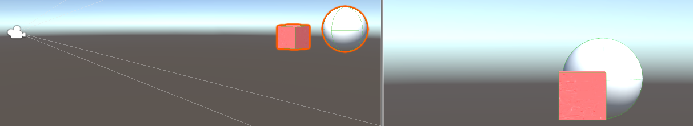

上图为无任何 `Blend` 命令的情况下 ，左边为 `Scene` 视图，右边为 `Game` 视图。

**前提条件：**

1. 立方体在前面，白色球体在立方体的后面。
2. 立方体的 `Tags` 为 `{ "RenderType"="Transprant" "Queue" = "Transparent" }` 
白色球体的 `Tags` 为 `{ "RenderType"="Transprant" "Queue" = "Transparent+100" }`，`Queue`使用 `Transprant` 保证了 `立方体` 在 `Game` 视图中不为黑色，白色球体的 `Queue` 为 `Transparent+100` 保证了白色球体比立方体后渲染。

**⚠️ 注意：下面是修改的立方体的 Shader ：**

* `Blend One One`：立方体材质的像素和 `GBuffer`(天空盒)中的像素混合渲染。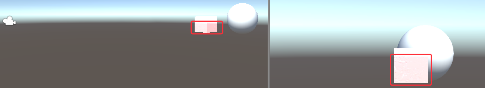
* `Blend One Zero`：只渲染立方体材质的像素。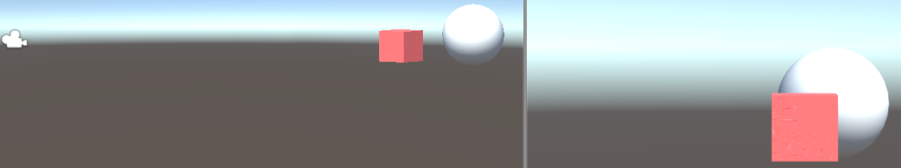
* `Blend Zero One`：只渲染 `GBuffer`(天空盒)中的像素。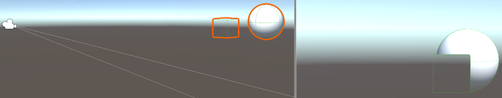
* `Blend SrcAlpha OneMinusSrcAlpha`：传统透明度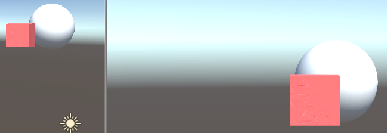
* `Blend SrcColor zero`：只显示立方体材质的源颜色 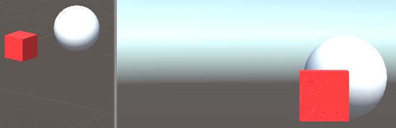
* `Blend SrcColor One`：混合立方体材质的源颜色和 `GBuffer`(天空盒)的源颜色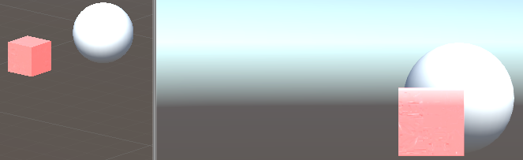

更多的组合请自行去尝试。

下面将通过[风宇冲博客](http://blog.sina.com.cn/s/blog_471132920101d8z5.html)中的几个具体的数值计算的小例子来加深理解，以 `Blend SrcAlpha OneMinusSrcAlpha` 为 🌰 ：

翻译成中文就是 `最终颜色 = 源颜色 * 源透明值 + 目标颜色 * (1 - 源透明值)`。

1. 假设贴图有一个不透明红色点 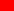 `Color(1, 0, 0, 1)`，该点背景色为不透明蓝色 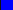 `Color(0, 0, 1, 1)`。

	`最终颜色 = (1, 0, 0) * 1 + (0, 0, 1) * (1 - 1) = (1, 0, 0)` 

	结论一：贴图 alpha 值为 1 时，仅显示贴图，不显示背景。

2. 假设贴图有一个透明红色点  `Color(1, 0, 0, 0)`，该点背景色为透明，但 `B` 通道值为 1，即 `Color(0, 0, 1, 0)`。

	`最终颜色 = (1, 0, 0) * 0 + (0, 0, 1) * (1 - 0) = (0, 0, 1)`  

	结论二：贴图 alpha 值为 0 时，仅显示混合目标即背景，不显示贴图。

	但是目标 alpha 值为 0，即其实这个点的背景是透明的，而我们却把它显示出来了，这就不对了。

	经验：带 A 通道的贴图中，不只 A 值为 0，RGB 值也要为 0，不然容易出错。

3. 假设贴图有一个半透明红色点 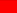 
 `Color(1, 0, 0, 0.8)`，该点背景色为不透明蓝色 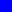
 `Color(0, 0, 1, 1)`。

	`最终颜色 = (1, 0, 0) * 0.8 + (0, 0, 1) * (1 - 0.8) = (0.8, 0, 0.2)` 

	而假如 0.8 变为 0.2 时，

	`最终颜色 = (1, 0, 0) * 0.2 + (0, 0, 1) * (1 - 0.2) = (0.2, 0, 0.8)`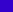

	结论：贴图 alpha 值越大，颜色越偏向贴图；alpha 值越小，颜色越偏向混合目标。

**参考文章:**

* [ShaderLab: Blending](https://docs.unity3d.com/Manual/SL-Blend.html)
* [Shader入门（十八）混合（Blend）命令](https://gameinstitute.qq.com/community/detail/121996)
*  [Shader第十三讲 Alpha混合](http://blog.sina.com.cn/s/blog_471132920101d8z5.html)

如有内容有误，欢迎 [issue](https://github.com/CYBoys/Blogs/issues/new) 指正。

**转载请注明出处！**
