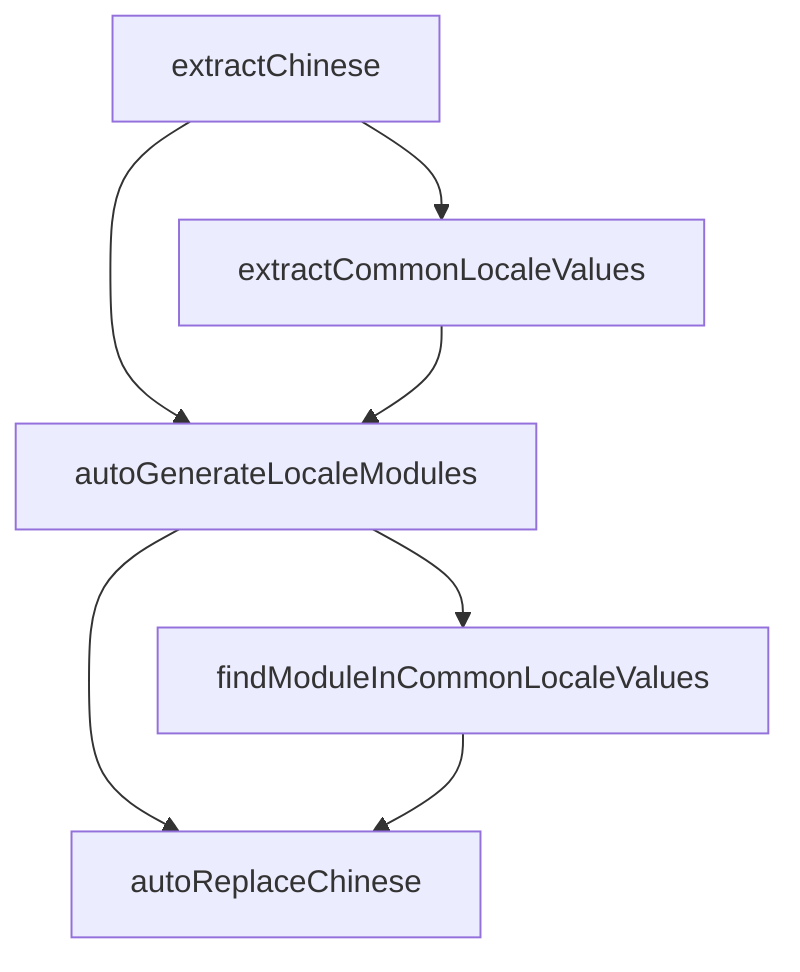

# fe-js-utils 使用手册

fe-js-utils 是一个前端代码质量检测和国际化处理的 JavaScript 工具集，提供了多种实用功能帮助开发者提高代码质量和实现国际化。

## 一、安装依赖

```bash
npm install fe-js-utils --save-dev
# 或
yarn add fe-js-utils -D
```

## 二、配置脚本命令

在 `package.json` 中添加以下 scripts：

```json
{
  "scripts": {
    "cleanInvalidComments": "fe-js-utils cleanInvalidComments",
    "checkAny": "fe-js-utils checkAny",
    "extractChinese": "fe-js-utils extractChinese",
    "extractCommonLocaleValues": "fe-js-utils extractCommonLocaleValues",
    "findModuleInCommonLocaleValues": "fe-js-utils findModuleInCommonLocaleValues",
    "autoGenerateLocaleModules": "fe-js-utils autoGenerateLocaleModules",
    "autoReplaceChinese": "fe-js-utils autoReplaceChinese"
  }
}
```

## 三、配置文件创建

### 步骤说明

1. 在项目根目录创建 `fe-js-utils.config.ts`
1. 使用以下基础模板（示例）：

```ts
// fe-js-utils.config.ts
const path = require('path');

module.exports = {
  checkAny: {
    targetDir: './src',
    outputFile: path.join(process.cwd(), 'check-any-results.js'),
    skipSet: [],
    extFiles: ['.ts', '.vue']
  },
  cleanInvalidComments: {
    targetDir: './src',
    extFiles: ['.js', '.ts', '.vue']
  },
  extractChinese: {
    targetDir: './src',
    outputFile: path.join(process.cwd(), 'extract-chinese-results.js'),
    extFiles: ['.js', '.ts', '.vue'],
    excludeFiles: [],
    excludeDirs: []
  },
  extractCommonLocaleValues: {
    outputFile: './src/locales/zh_CN/Common.ts'
  },
  findModuleInCommonLocaleValues: {
    localeDir: './src/locales/zh_CN',
    commonLocaleModule: 'Common',
    localModules: ['ObjectConstruction', 'DataDirectoryMgmt']
  },
  autoGenerateLocaleModules: {
    outputDir: './src/locales/zh_CN',
    runExtractFirst: true
  },
  autoReplaceChinese: {
    localeDir: './src/locales/zh_CN',
    commonLocaleModule: 'Common',
    localModules: ['ObjectConstruction', 'DataDirectoryMgmt'],
    customImportStatements: (imports: string[], filePath: string, localModule: string) => {
      // 自定义 import 语句的回调，返回一个 import 语句字符串的数组，为空时不会添加任何 import 语句
      return [];
    },
    customVariableDeclarations: (fileContent: string, filePath: string, localModule: string, needsCommon: boolean) => {
      // 自定义 变量声明 的回调，返回一个变量声明字符串的数组，为空时不会添加任何变量声明
      return '';
    },
    customReplaceTextFunction: (
      filePath: string,
      localModule: string,
      chineseKey: string,
      englishValue: string,
      isInCommon: boolean,
      context: string
    ) => {
      // 自定义 替换中文字符 的回调，返回一个替换后的字符串，为空时将不会替换任何中文字符
      // 示例：
      return `$t('${localModule}.${englishValue}')`;
    }
  }
};
```

**注意事项：**

1. 使用 `.ts` 文件时，Node 版本需要 >= `v22.18.0`，使用 `.js` 无要求；
2. 在 fe-js-utils.config 配置文件中 import ts 文件请添加 `.ts` 后缀

## 四、工具及配置项说明

### 1. checkAny（Any类型检查）

**功能**：扫描项目中的 `any` 类型的使用  
**使用场景**：

- 代码质量检查
- TypeScript类型规范审计

**配置项说明：**

| 配置项     | 类型     | 默认值                                  | 说明                                                   |
| ---------- | -------- | --------------------------------------- | ------------------------------------------------------ |
| targetDir  | string   | './src'                                 | 需要扫描的源码目录                                     |
| outputFile | string   | `${process.cwd()}/check-any-results.js` | 结果输出文件路径                                       |
| skipSet    | string[] | []                                      | 需要跳过的代码模式（包含这些字符串的代码行将不被检测） |
| extFiles   | string[] | ['.ts', '.vue']                         | 需要扫描的文件扩展名                                   |

#### 使用方式

```bash
# 执行 any 类型检查
npm run checkAny
# 或
yarn checkAny
```

#### 配置示例

```ts
// fe-js-utils.config.ts
module.exports = {
  checkAny: {
    // 需要扫描的源码目录
    targetDir: './src',
    // 结果输出文件路径
    outputFile: './check-any-results.js',
    // 需要跳过的代码模式
    skipSet: ['cancelCb?: (error: any) => void;', 'valueComponent?: any;'],
    // 需要扫描的文件扩展名
    extFiles: ['.ts', '.vue']
  }
};
```

#### 输出格式

生成的 `check-any-results.js` 文件格式如下：

```javascript
// src/components/user/UserService.ts
['value?: any;', 'fail?: (err: any) => void;'];

// src/components/alarm/AlarmService.ts
['let obj: any = "";'];
```

---

### 2. cleanInvalidComments（无效注释清理）

**功能**：清理无效的JSDoc注释  
**清理规则**：

- 自动清理`/** ... */`格式没有描述的`@param`及`@returns`

**配置项说明：**

| 配置项    | 类型     | 默认值                 | 说明                   |
| --------- | -------- | ---------------------- | ---------------------- |
| targetDir | string   | './src'                | 需要清理注释的源码目录 |
| extFiles  | string[] | ['.js', '.ts', '.vue'] | 需要处理的文件扩展名   |

#### 使用方式

```bash
# 执行注释清理
npm run cleanInvalidComments
# 或
yarn cleanInvalidComments
```

#### 配置示例

```ts
// fe-js-utils.config.ts
module.exports = {
  cleanInvalidComments: {
    // 需要清理注释的源码目录
    targetDir: './src',
    // 需要处理的文件扩展名
    extFiles: ['.js', '.ts', '.vue']
  }
};
```

---

### 3. extractChinese（中文提取）

**功能**：提取项目中的中文字符  
**使用场景**：

- 方便快速国际化的适配
- 识别项目中所有硬编码的中文文案
- 为后续的国际化处理提供数据基础

**配置项说明：**

| 配置项       | 类型     | 默认值                                               | 说明                 |
| ------------ | -------- | ---------------------------------------------------- | -------------------- |
| targetDir    | string   | './src'                                              | 需要扫描的源码目录   |
| outputFile   | string   | `${process.cwd()}/extract-chinese-results.js`        | 结果输出文件路径     |
| extFiles     | string[] | ['.js', '.jsx', '.ts', '.tsx', '.vue', '.html']      | 需要扫描的文件扩展名 |
| excludeDirs  | string[] | ['node_modules', 'dist', 'build', 'locales']         | 需要排除的目录       |
| excludeFiles | string[] | ['extract-chinese-results.js', 'extract-chinese.js'] | 需要排除的特定文件   |
| verbose      | boolean  | false                                                | 是否显示处理过程日志 |

#### 使用方式

```bash
# 执行中文提取
npm run extractChinese
# 或
yarn extractChinese
```

#### 配置示例

```ts
// fe-js-utils.config.ts
module.exports = {
  extractChinese: {
    // 需要扫描的源码目录
    targetDir: './src',
    // 结果输出文件路径
    outputFile: './extract-chinese-results.js',
    // 需要扫描的文件扩展名
    extFiles: ['.js', '.ts', '.vue'],
    // 需要排除的目录
    excludeDirs: ['node_modules', 'dist', 'build', 'locales'],
    // 需要排除的特定文件
    excludeFiles: ['extract-chinese-results.js'],
    // 显示详细处理过程日志
    verbose: false
  }
};
```

#### 输出格式

生成的 `extract-chinese-results.js` 文件格式如下：

```javascript
// src/components/user/UserList.vue
['用户管理', '新增用户', '编辑用户'];

// src/components/alarm/AlarmList.vue
['报警列表', '报警级别', '处理状态'];
```

---

### 4. extractCommonLocaleValues（提取公共语言包）

**功能**：从 `extractChinese` 的输出结果中提取重复出现的中文字符串，并生成公共语言包模块文件  
**使用场景**：

- 自动识别项目中多处使用的相同文案
- 生成公共语言包，避免重复定义
- 为国际化提供共享的通用文案

**配置项说明：**

| 配置项     | 类型    | 默认值                          | 说明                             |
| ---------- | ------- | ------------------------------- | -------------------------------- |
| inputFile  | string  | extractChinese.outputFile       | 输入文件路径（中文提取结果文件） |
| outputFile | string  | './src/locales/zh_CN/Common.ts' | 输出文件路径（公共语言包文件）   |
| verbose    | boolean | false                           | 是否显示处理过程日志             |

#### 使用方式

```bash
# 执行公共语言包提取
npm run extractCommonLocaleValues
# 或
yarn extractCommonLocaleValues
```

#### 配置示例

```ts
// fe-js-utils.config.ts
module.exports = {
  extractCommonLocaleValues: {
    // 输出文件路径
    outputFile: './src/locales/zh_CN/Common.ts',
    // 显示详细处理过程日志
    verbose: false
  }
};
```

#### 输出格式

生成的公共语言包文件格式如下：

```typescript
export default {
  key0: '确定',
  key1: '取消',
  key2: '保存',
  key3: '删除'
};
```

#### 注意事项

1. 由于目前翻译插件的一些限制，无法进行大批量翻译处理，所以生成的语言文件中的 key 为自增的 `keyIndex`，请自行使用 ChatGPT 或 DeepSeek 等 AI 工具进行翻译处理。

---

### 5. findModuleInCommonLocaleValues（查找指定模块与公共模块重复值）

**功能**：找出指定模块中与公共模块（Common）中定义相同的中文值  
**使用场景**：

- 检测模块中哪些文案已在公共模块中定义
- 识别可以复用公共文案的地方
- 避免重复定义相同的国际化文案

**配置项说明：**

| 配置项                          | 类型     | 默认值                | 说明                                                             |
| ------------------------------- | -------- | --------------------- | ---------------------------------------------------------------- |
| localeDir                       | string   | './src/locales/zh_CN' | 语言包文件所在目录                                               |
| localModules                    | string[] | []                    | 需要检查的模块文件名列表                                         |
| commonLocaleModule              | string   | 'Common'              | 公共语言包模块文件名                                             |
| annotationDefinedInCommonLocale | boolean  | false                 | 是否在 localModules 中注释掉在 commonLocaleModule 中已存在的定义 |
| verbose                         | boolean  | false                 | 是否显示处理过程日志                                             |

#### 使用方式

```bash
# 查找模块与公共模块的重复值
npm run findModuleInCommonLocaleValues
# 或
yarn findModuleInCommonLocaleValues
```

#### 配置示例

```ts
// fe-js-utils.config.ts
module.exports = {
  findModuleInCommonLocaleValues: {
    // 语言包目录
    localeDir: './src/locales/zh_CN',
    // 需要检查的模块列表
    localModules: ['UserManagement', 'AlarmConfig', 'DataDirectory'],
    // 公共模块名称
    commonLocaleModule: 'Common',
    // 是否在 localModules 中注释掉在 commonLocaleModule 中已存在的定义
    annotationDefinedInCommonLocale: true,
    // 显示详细处理过程日志
    verbose: false
  }
};
```

#### 输出格式

输出结果格式如下：

```
============find-common-locale-values============

UserManagement 中在 Common 中出现过的值:
[
  "确定",
  "取消",
  "保存",
  "删除"
]

总共找到 4 个相同的值
```

---

### 6. autoGenerateLocaleModules（自动生成国际化模块文件）

**功能**：根据 `extractChinese` 提取的中文结果自动生成国际化模块文件

**使用场景**：

- 自动化生成国际化语言包
- 按模块划分语言资源
- 快速构建项目国际化基础结构

**配置项说明：**

| 配置项                          | 类型    | 默认值                         | 说明                                                                                                                                                                  |
| ------------------------------- | ------- | ------------------------------ | --------------------------------------------------------------------------------------------------------------------------------------------------------------------- |
| inputFile                       | string  | extractChinese.outputFile 的值 | 中文提取结果文件路径（通常自动从 extractChinese 配置中获取）                                                                                                          |
| outputDir                       | string  | './src/locales/zh_CN'          | 生成的语言包文件输出目录                                                                                                                                              |
| verbose                         | boolean | false                          | 是否显示详细处理过程日志                                                                                                                                              |
| runExtractFirst                 | boolean | false                          | 是否在生成前自动执行中文提取操作                                                                                                                                      |
| autoExtractCommonLocale         | boolean | true                           | 是否自动提取公共语言包                                                                                                                                                |
| annotationDefinedInCommonLocale | boolean | true                           | 是否对已在公共语言包中定义的中文进行注释标记                                                                                                                          |
| customModuleDefinitions         | object  | {}                             | 允许用户自定义模块命名规则，格式为 `{ moduleName: filePathPrefix }`。将特定路径前缀映射到指定的模块名称，键为模块名称，值为文件路径前缀，未定义的将按照默认规则处理。 |

#### 使用方式

##### 1. 基础使用（依赖已有的提取结果）

首先确保已通过 `extractChinese` 命令生成了中文提取结果文件：

```bash
# 先执行中文提取
npm run extractChinese
# 或
yarn extractChinese

# 再生成国际化模块
npm run autoGenerateLocaleModules
# 或
yarn autoGenerateLocaleModules
```

##### 2. 自动提取并生成（推荐）

配置 `runExtractFirst: true` 后，工具会自动先执行中文提取再生成模块：

```bash
# 一条命令完成中文提取和模块生成
npm run autoGenerateLocaleModules
# 或
yarn autoGenerateLocaleModules
```

#### 配置示例

```ts
// fe-js-utils.config.ts
module.exports = {
  extractChinese: {
    targetDir: './src',
    outputFile: './extract-chinese-results.js',
    extFiles: ['.js', '.ts', '.vue'],
    excludeDirs: ['node_modules', 'dist', 'build', 'locales']
  },

  autoGenerateLocaleModules: {
    // 输入文件路径（中文提取结果文件）
    inputFile: './extract-chinese-results.js',
    // 语言包输出目录
    outputDir: './src/locales/zh_CN',
    // 显示详细日志
    verbose: false,
    // 在生成前自动执行中文提取
    runExtractFirst: true,
    // 自动提取公共语言包
    autoExtractCommonLocale: true,
    // 对已在公共语言包中定义的中文进行注释标记
    annotationDefinedInCommonLocale: true,
    // 自定义模块定义规则
    customModuleDefinitions: {
      Notice: 'src/components/alarm-notice',
      Directory: 'src/components/common-directory-view',
      StructureField: 'src/components/structure-field-table'
    }
  }
};
```

#### 生成规则

##### 1. 模块命名规则

默认根据文件路径自动生成模块名：

- 路径：`src/components/user-management/UserList.vue`
- 模块名：`UserManagement`（取第三级目录名并转为大驼峰命名）

如果配置了 `customModuleDefinitions`，则优先使用自定义规则：

- 配置：`{ Notice: 'src/components/alarm-notice' }`
- 与 `src/components/alarm-notice` 文件路径相关的所有文件都会归类到 `Notice` 模块，例如：
  - `src/components/alarm-notice.vue`
  - `src/components/alarm-notice.ts`
  - `src/components/alarm-notice/alarm-notice-detail/index.vue`
  - `src/components/alarm-notice/table-field-selector-dialog/index.vue`
- 模块名：`Notice`（使用自定义模块名）

##### 2. 文件结构示例

输入文件（extract-chinese-results.js）：

```javascript
// src/components/user-management/UserList.vue
['用户管理', '新增用户', '编辑用户'];

// src/components/alarm-config/AlarmSetting.vue
['报警配置', '保存设置', '取消'];
```

输出文件结构：

```
localesDir/
├── UserManagement.ts
└── AlarmConfig.ts
```

输出文件内容（UserManagement.ts）：

```typescript
export default {
  // src/components/user-management/UserList.vue
  key0: '用户管理',
  key1: '新增用户',
  key2: '编辑用户'
};
```

#### 注意事项

1. 生成 `index.ts` 文件，需要手动注册到 `i18n` 或其他语言包管理工具中；
2. 由于目前翻译插件的一些限制，无法进行大批量翻译处理，所以生成的语言文件中的 key 为自增的 `keyIndex`，请自行使用 ChatGPT 或 DeepSeek 等 AI 工具进行翻译处理。

---

### 7. autoReplaceChinese（自动替换项目中的中文文案）

**功能**：根据语言包文件自动替换源代码中的中文字符串为国际化调用函数  
**使用场景**：

- 自动化完成项目国际化改造
- 将硬编码的中文字符串替换为动态调用
- 统一项目中文案的使用方式

**配置项说明：**

| 配置项                            | 类型     | 默认值                | 说明                                                                         |
| --------------------------------- | -------- | --------------------- | ---------------------------------------------------------------------------- |
| localeDir                         | string   | './src/locales/zh_CN' | 语言包文件所在目录                                                           |
| localModules                      | string[] | []                    | 需要处理的语言模块文件名列表，对应 LLMT 枚举的值                             |
| commonLocaleModule                | string   | 'Common'              | 公共语言包模块文件名                                                         |
| variableDeclarationInsertPosition | string   | '// #region Hooks'    | 变量声明插入位置标记，如果值为空或在文件中未找到，则插入到 import 语句的最后 |
| verbose                           | boolean  | false                 | 是否显示处理过程日志                                                         |
| customImportStatements            | function | null                  | 自定义 import 语句回调函数                                                   |
| customVariableDeclarations        | function | null                  | 自定义变量定义语句回调函数                                                   |
| customReplaceTextFunction         | function | null                  | 自定义文本替换回调函数                                                       |

#### 使用方式

```bash
# 自动替换项目中的中文文案
npm run autoReplaceChinese
# 或
yarn autoReplaceChinese
```

#### 配置示例

```ts
// fe-js-utils.config.ts
module.exports = {
  autoReplaceChinese: {
    // 语言包目录
    localeDir: './src/locales/zh_CN',
    // 需要处理的模块列表
    localModules: ['UserManagement', 'AlarmConfig', 'DataDirectory'],
    // 公共模块名称
    commonLocaleModule: 'Common',
    // 变量声明插入位置，默认为 // #region Hooks，如果值为空或在文件中未找到，则插入到 import 语句的最后
    variableDeclarationInsertPosition: '// #region Hooks',
    // 显示详细日志
    verbose: false,
    // 自定义 import 语句的回调函数
    customImportStatements: (imports: string[], filePath: string, localModule: string) => {
      // 返回一个 import 语句字符串的数组，为空时不会添加任何 import 语句
      return [];
    },
    // 自定义变量声明的回调函数
    customVariableDeclarations: (fileContent: string, filePath: string, localModule: string, needsCommon: boolean) => {
      // 返回一个变量声明字符串，为空时不会添加任何变量声明
      return '';
    },
    // 自定义替换文本的回调函数
    customReplaceTextFunction: (
      filePath: string,
      localModule: string,
      chineseKey: string,
      englishValue: string,
      isCommon: boolean,
      context: string
    ) => {
      // 返回一个替换后的字符串，为空时将不会替换任何中文字符
      // 示例：
      return `$t('${localModule}.${englishValue}')`;
    }
  }
};
```

#### 注意事项

1. **语言文件格式**：确保语言文件遵循指定格式，包含文件路径注释和键值对
2. **源文件结构**：源文件中需要有 `// #region Hooks` 注释标记hook插入位置
3. **依赖项**：如果没有实现几个对应的**自定义替换函数**，则项目中需要存在 `useLocalLang` hook和 `LLMT` 枚举类型
4. **备份文件**：建议在执行前备份源文件，防止替换错误
5. **逐步执行**：建议先在少数模块上测试，确认效果后再批量处理
6. **自定义函数**：
   - `customImportStatements`：用于自定义添加的import语句，回调参数为 `(existingImports: string[], filePath: string, localModule: string)`
   - `customVariableDeclarations`：用于自定义添加的变量声明，回调参数为 `(fileContent: string, filePath: string, localModule: string, needsCommon: boolean)`
   - `customReplaceTextFunction`：用于自定义文本替换逻辑，回调参数为 `(filePath: string, localModule: string, chineseKey: string, englishValue: string, isCommon: boolean, context: string)`
7. 不支持格式化字符串处理，需要手动处理

#### 执行效果

执行前：

```vue
<template>
  <div>
    <el-button @click="save">保存</el-button>
    <el-button @click="cancel">取消</el-button>
  </div>
</template>

<script>
// #region Hooks

export default {
  methods: {
    save() {
      this.$message.success('保存成功');
    },
    cancel() {
      this.$emit('cancel');
    }
  }
};
</script>
```

执行后：

```vue
<template>
  <div>
    <el-button @click="save">{{ localLang('save') }}</el-button>
    <el-button @click="cancel">{{ localLang('cancel') }}</el-button>
  </div>
</template>

<script>
import { useLocalLang } from '@/hooks/UseLocalLang';
import { LLMT } from '@/model/bo/LocalBO';

// #region Hooks
const { localLang } = useLocalLang(LLMT.UserManagement);
// #endregion

export default {
  methods: {
    save() {
      this.$message.success(localLang('saveSuccess'));
    },
    cancel() {
      this.$emit('cancel');
    }
  }
};
</script>
```

### 8. findUnusedLocaleKeys（查找未使用的国际化键值）

**功能**：扫描项目源代码，查找语言包中定义但未被使用的国际化键值  
**使用场景**：

- 清理无用的国际化键值，保持语言包精简
- 发现可以删除的冗余国际化定义
- 维护语言包质量，避免资源浪费

**配置项说明：**

| 配置项      | 类型     | 默认值                            | 说明                                                        |
| ----------- | -------- | --------------------------------- | ----------------------------------------------------------- |
| localeDir   | string   | './src/locales/zh_CN/ui'          | 语言包文件所在目录                                          |
| srcDir      | string   | './src'                           | 需要扫描的源码目录                                          |
| outputFile  | string   | './unused-locale-keys.json'       | 结果输出文件路径                                            |
| excludeDirs | string[] | ['node_modules', 'dist']          | 扫描时需要排除的目录                                        |
| indexFile   | string   | './src/locales/zh_CN/ui/index.ts' | 语言包索引文件路径                                          |
| patterns    | string[] | 见下方默认值                      | 匹配国际化调用的匹配模式                                    |
| strict      | boolean  | false                             | 是否启用严格模式（仅在类似 `t({module}.{key})` 情况下有效） |
| verbose     | boolean  | false                             | 是否显示处理过程日志                                        |

**patterns 默认值：**

支持自定义匹配模式，需遵循的格式：`{module}` 表示模块，`{key}` 表示key

```javascript
[
  'localKey({module}, {key})',
  'localLang({key})',
  'localLang_mp({module}, {key})',
  'localLang_mpV({module}, {key}, ...)',
  'localLangV({key}, ...)',
  't({module}.{key})',
  't({module}.{key}, ...)'
];
```

#### 使用方式

```bash
# 查找未使用的国际化键值
npm run findUnusedLocaleKeys
# 或
yarn findUnusedLocaleKeys
```

#### 配置示例

```ts
// fe-js-utils.config.ts
module.exports = {
  findUnusedLocaleKeys: {
    // 语言包文件所在目录
    localeDir: './src/locales/zh_CN/ui',
    // 需要扫描的源码目录
    srcDir: './src',
    // 结果输出文件路径
    outputFile: './unused-locale-keys.json',
    // 扫描时需要排除的目录
    excludeDirs: ['node_modules', 'dist'],
    // 语言包索引文件路径
    indexFile: './src/locales/zh_CN/ui/index.ts',
    // 匹配国际化调用的模式
    patterns: [
      'localKey({module}, {key})',
      'localLang({key})',
      'localLang_mp({module}, {key})',
      'localLang_mpV({module}, {key}, ...)',
      'localLangV({key}, ...)',
      't({module}.{key})',
      't({module}.{key}, ...)'
    ],
    // 是否启用严格模式
    strict: false,
    // 显示详细处理过程日志
    verbose: false
  }
};
```

#### 输出格式

生成的 `unused-locale-keys.json` 文件格式如下：

```json
{
  "UserManagement": ["unusedKey1", "unusedKey2"],
  "AlarmConfig": ["obsoleteKey"]
}
```

### 9. findMissingLocaleKeys（查找缺失的国际化键值）

**功能**：扫描项目中的多种语言包，查找不同语言之间缺失的国际化键值  
**使用场景**：

- 确保多语言版本的一致性
- 发现某些语言包中缺失的翻译条目
- 维护多语言项目的完整性

**配置项说明：**

| 配置项     | 类型    | 默认值                                                     | 说明                                 |
| ---------- | ------- | ---------------------------------------------------------- | ------------------------------------ |
| locales    | object  | { zh: 'src/locales/zh_CN/ui', en: 'src/locales/en_US/ui' } | 各语言包文件所在目录映射             |
| indexFile  | string  | 'src/locales/zh_CN/ui/index.ts'                            | 索引文件路径（用于获取模块映射关系） |
| outputFile | string  | './missing-locale-keys.js'                                 | 结果输出文件路径                     |
| verbose    | boolean | false                                                      | 是否显示处理过程日志                 |

#### 使用方式

```bash
# 查找缺失的国际化键值
npm run findMissingLocaleKeys
# 或
yarn findMissingLocaleKeys
```

#### 配置示例

```ts
// fe-js-utils.config.ts
module.exports = {
  findMissingLocaleKeys: {
    // 各语言包文件所在目录映射，支持扩展其他语言包
    locales: {
      zh: 'src/locales/zh_CN/ui',
      en: 'src/locales/en_US/ui',
      ...
    },
    // 索引文件路径（用于获取模块映射关系）
    indexFile: 'src/locales/zh_CN/ui/index.ts',
    // 结果输出文件路径
    outputFile: './missing-locale-keys.js',
    // 显示详细处理过程日志
    verbose: false
  }
};
```

#### 输出格式

生成的 `missing-locale-keys.js` 文件格式如下：

```javascript
// 多语言键缺失统计信息:
const statistics = {
  totalKeys: 45,
  byLanguage: {
    zh: {
      total: 45,
      missing: 0,
      coverage: '100.00%'
    },
    en: {
      total: 42,
      missing: 3,
      coverage: '93.33%'
    }
  },
  byModule: {}
};

const missingKeys = [
  // ================= en 👇 =================
  // en UserManagement 模块需要补充的
  ['confirm', 'cancel', 'save']
];
export { statistics, missingKeys };
```

---

## 国际化文案处理工具间的关系与组合使用指南

这些工具按照国际化文案处理流程形成了一个完整的工具链，每个工具都有其特定的功能和作用。以下是它们之间的关系和推荐的组合使用方式：

### 工具间的关系

1. **extractChinese（中文提取）**
   - **作用**：扫描整个项目源码，提取所有硬编码的中文文本
   - **输出**：生成 `extract-chinese-results.js` 文件，包含按文件组织的中文文本列表
   - **地位**：整个国际化流程的起点和数据源

2. **extractCommonLocaleValues（提取公共语言包）**
   - **依赖**：需要 `extractChinese` 的输出结果
   - **作用**：分析提取结果，找出在多个文件中重复出现的中文文本
   - **输出**：生成 `Common.ts` 公共语言包文件

3. **autoGenerateLocaleModules（自动生成语言模块）**
   - **依赖**：需要 `extractChinese` 的输出结果
   - **作用**：根据提取的中文文本按模块划分生成语言包文件
   - **可选依赖**：可与 `extractCommonLocaleValues` 配合使用，避免重复定义
   - **输出**：生成多个模块化的语言包文件和 `index.ts` 索引文件

4. **findModuleInCommonLocaleValues（查找模块与公共模块重复值）**
   - **依赖**：需要 `extractCommonLocaleValues` 生成的公共语言包和模块语言包
   - **作用**：分析各个模块语言包与公共语言包的重复项
   - **输出**：控制台输出重复项分析结果

5. **autoReplaceChinese（自动替换中文）**
   - **依赖**：需要模块语言包文件（由 `autoGenerateLocaleModules` 生成）
   - **作用**：自动替换源码中的硬编码中文为国际化调用函数
   - **输出**：修改后的源代码文件

### 推荐的组合使用流程

#### 方案一：完整国际化流程（推荐）

```bash
# 1. 提取项目中所有中文文本
npx fe-js-utils extractChinese

# 2. 自动生成模块化语言包（会自动调用extractCommonLocaleValues）
npx fe-js-utils autoGenerateLocaleModules

# 3. 查看模块与公共语言包的重复项（可选）
npx fe-js-utils findModuleInCommonLocaleValues

# 4. 自动替换源码中的中文
npx fe-js-utils autoReplaceChinese
```

#### 方案二：分步执行

```bash
# 1. 提取项目中所有中文文本
npx fe-js-utils extractChinese

# 2. 提取公共语言包（可选）
npx fe-js-utils extractCommonLocaleValues

# 3. 生成模块化语言包
npx fe-js-utils autoGenerateLocaleModules

# 4. 替换源码中的中文
npx fe-js-utils autoReplaceChinese
```

### 各工具的执行顺序和依赖关系



### 详细使用说明

#### 第一步：extractChinese（中文提取）

这是整个流程的起点，负责扫描项目中的所有硬编码中文：

```bash
npx fe-js-utils extractChinese
```

执行后会生成 `extract-chinese-results.js` 文件，格式如下：

```javascript
// src/components/user/UserList.vue
['用户管理', '新增用户', '编辑用户'];

// src/components/alarm/AlarmList.vue
['报警列表', '报警级别', '处理状态'];
```

#### 第二步：extractCommonLocaleValues（提取公共语言包）

分析提取结果，找出重复出现的中文文本：

```bash
npx fe-js-utils extractCommonLocaleValues
```

生成 `Common.ts` 文件：

```typescript
export default {
  key0: '确定',
  key1: '取消',
  key2: '保存'
};
```

#### 第三步：autoGenerateLocaleModules（生成模块化语言包）

根据提取结果生成模块化的语言包文件：

```bash
npx fe-js-utils autoGenerateLocaleModules
```

会生成如下文件结构：

```
locales/
├── Common.ts          # 公共语言包
├── UserList.ts        # 用户模块语言包
├── AlarmList.ts       # 报警模块语言包
└── index.ts           # 导出索引文件
```

#### 第四步：findModuleInCommonLocaleValues（可选，分析重复项）

检查各模块语言包与公共语言包的重复情况：

```bash
npx fe-js-utils findModuleInCommonLocaleValues
```

输出示例：

```
UserList 中在 Common 中出现过的值:
[
  "保存",
  "取消"
]
```

#### 第五步：autoReplaceChinese（替换源码中的中文）

最后一步，自动替换源码中的硬编码中文：

```bash
npx fe-js-utils autoReplaceChinese
```

替换前：

```vue
<template>
  <el-button @click="save">保存</el-button>
</template>
```

替换后：

```vue
<template>
  <el-button @click="save">{{ localLang('key0') }}</el-button>
</template>
```

### 配置建议

为了确保工具链正常工作，建议在 `fe-js-utils.config.ts` 中进行如下配置：

```ts
module.exports = {
  extractChinese: {
    targetDir: './src',
    outputFile: './extract-chinese-results.js',
    extFiles: ['.js', '.ts', '.vue']
  },

  extractCommonLocaleValues: {
    outputFile: './src/locales/zh_CN/Common.ts'
  },

  autoGenerateLocaleModules: {
    outputDir: './src/locales/zh_CN',
    runExtractFirst: true, // 自动先执行extractChinese
    autoExtractCommonLocale: true // 自动执行extractCommonLocaleValues
  },

  findModuleInCommonLocaleValues: {
    localeDir: './src/locales/zh_CN',
    commonLocaleModule: 'Common',
    localModules: ['UserList', 'AlarmList']
  },

  autoReplaceChinese: {
    localeDir: './src/locales/zh_CN',
    commonLocaleModule: 'Common',
    localModules: ['UserList', 'AlarmList']
  }
};
```

---

更灵活贴合业务代码的 ESLint 代码质量检测工具 👇

- Github 👉 **[eslint-plugin-aegis](https://github.com/LLLaiYoung/eslint-plugin-aegis)**
- NPM 👉 **[eslint-plugin-aegis](https://www.npmjs.com/package/eslint-plugin-aegis)**
