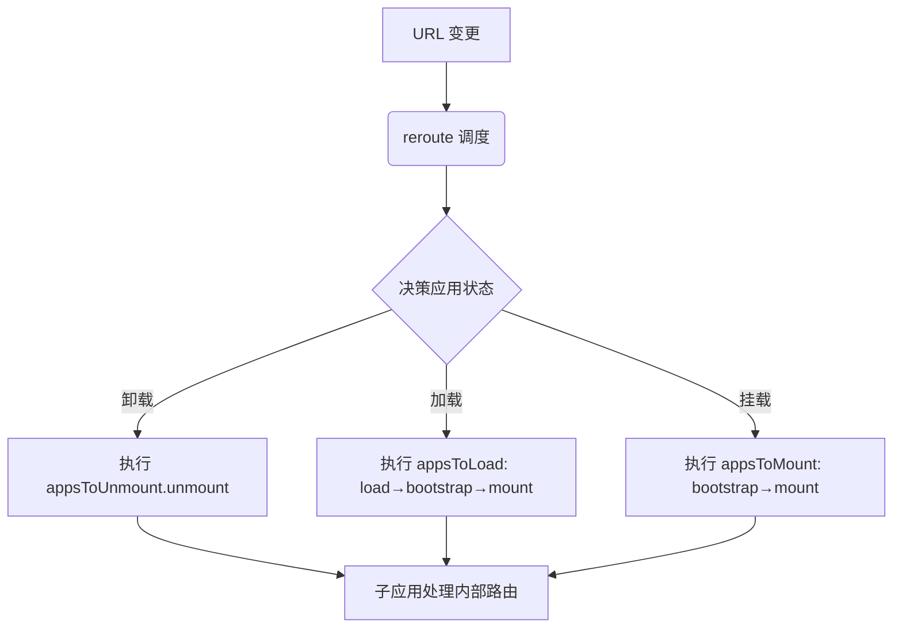

# 深入解析 single-spa 微前端框架核心原理

## 1. 核心角色和数据结构

在源码里，single-spa 主要维护三个核心东西：

1. **apps 数组**
   存放通过 `registerApplication()` 注册的所有应用对象，每个对象大致是：

   ```js
   {
     name,            // 应用唯一标识
     loadApp,         // 应用加载函数（如动态 import）
     activeWhen,      // 路由激活条件函数
     customProps,     // 自定义参数
     status,          // 当前状态（见下）
     parcels,         // 该应用内的 parcel
   }
   ```

2. **状态枚举（ApplicationStatus）**
   single-spa 用状态机驱动应用生命周期，主要有：

   - `NOT_LOADED`（未加载）
   - `LOADING_SOURCE_CODE`（正在加载源码）
   - `NOT_BOOTSTRAPPED`（已加载但未引导）
   - `BOOTSTRAPPING` / `NOT_MOUNTED`
   - `MOUNTING` / `MOUNTED`
   - `UNMOUNTING`
     状态切换是严格受控的。

3. **生命周期函数队列**
   每个应用内部会被包装成 Promise 链形式的生命周期调用，保证**顺序和状态安全**。

---

## 2. 路由劫持与调度循环

当你调用 `start()` 时，single-spa 做了两件关键事：

1. **劫持路由变化事件**
   它会 monkey-patch：

   - `window.addEventListener('hashchange', ...)`
   - `window.addEventListener('popstate', ...)`
   - 以及 `history.pushState` / `history.replaceState`
     这样一旦 URL 改变，single-spa 就能感知并触发自己的调度函数 `reroute()`。

2. **触发首次 reroute**
   reroute 会根据当前 URL 判断哪些应用要挂载、卸载。

---

## 3. reroute 核心逻辑

可以把 reroute 想成一次“小调度循环”：

```js
function reroute() {
  // 计算应用变更集合
  const { appsToLoad, appsToMount, appsToUnmount } = getAppChanges();

  // 卸载阶段
  appsToUnmount.forEach(toUnmountPromise);

  // 加载 + 引导 + 挂载阶段
  appsToLoad.forEach((app) => {
    toLoadPromise(app) // 变成 NOT_BOOTSTRAPPED
      .then(toBootstrapPromise)
      .then(toMountPromise);
  });

  appsToMount.forEach((app) => {
    toBootstrapPromise(app).then(toMountPromise);
  });
}
```

几个要点：

- **appsToLoad**：当前未加载且 URL 满足 activeWhen
- **appsToMount**：已加载但未挂载且需要挂载
- **appsToUnmount**：已挂载但不再满足 activeWhen

这就是它的核心运行循环。

---

## 4. 生命周期调用细节

### 4.1 加载（loadApp）

- 如果 loadApp 是 `() => import(...)`，就会动态加载模块
- 模块必须导出 `bootstrap` / `mount` / `unmount`（Promise 或 async）
- 加载完成后状态从 `NOT_LOADED` 变为 `NOT_BOOTSTRAPPED`

### 4.2 bootstrap

- 调用你的 `bootstrap()` 函数
- 通常初始化框架运行时（创建 Vue 实例、注册插件等）
- 成功后状态从 `NOT_BOOTSTRAPPED` 变为 `NOT_MOUNTED`

### 4.3 mount

- 调用你的 `mount()`，渲染到指定 DOM
- 期间你接管内部路由、渲染 UI
- 成功后状态从 `NOT_MOUNTED` 变为 `MOUNTED`

### 4.4 unmount

- 调用你的 `unmount()`，清理 DOM、事件监听、定时器等
- 成功后状态回到 `NOT_MOUNTED`

已挂载应用内部路由切换由子框架（如 Vue Router）处理，不会触发 single-spa 的重复挂载。

### 运行时流程（URL 变更时）



---

## 5. 核心设计理念

- **最小内核**：single-spa 本身只关心**应用状态机 + 路由调度 + 生命周期调用**，其他（CSS 隔离、JS 沙箱、依赖共享）都交给外围生态或你自己实现
- **框架无关**：它不依赖 React/Vue/Angular，只要你的应用能实现这三个生命周期函数，就能挂载
- **可组合**：通过 Parcels 实现更小粒度的动态加载/卸载

---

## 6. 核心 API 一眼看懂

- **`registerApplication({ name, app, activeWhen, customProps })`**：注册应用。`app` 可是动态 `import()` 的加载函数；`activeWhen` 决定何时挂载（可路径前缀、函数等）；`customProps` 会在每个生命周期里拿到。
- **`start()`**：开始接管路由与调度。未 `start` 前只“加载”，不引导/挂载。

## 7. 核心缺陷（从源码设计看）

1. **样式/全局隔离不内置**
   single-spa 不主动做 CSS/JS 沙箱，样式容易互相污染、全局变量易冲突。要靠**命名约定、CSS Modules、Shadow DOM、BEM、前缀化**或引入第三方沙箱。
2. **性能开销与切换延迟**
   状态机是串行 Promise 调用，如果某个生命周期耗时长，会阻塞当前阶段
3. **路由监听方式粗粒度**
   所有路由变更都会 reroute，没有内建“差分调度”优化
4. **卸载不强制清理**
   框架不检测你是否正确释放资源，内存泄漏风险高。频繁 mount/unmount 的应用如果没有**彻底清理副作用**（事件、定时器、订阅），会造成内存泄漏或“幽灵监听器”。文档虽强调要清理，但实现质量靠团队自律。

---
